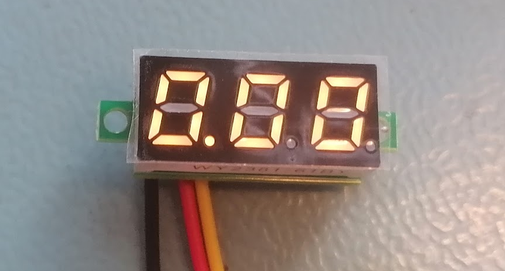
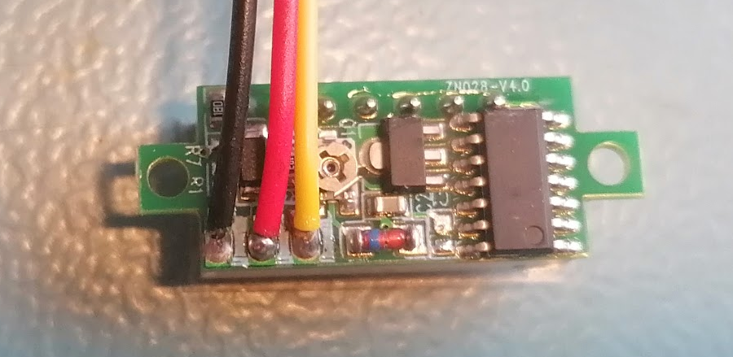
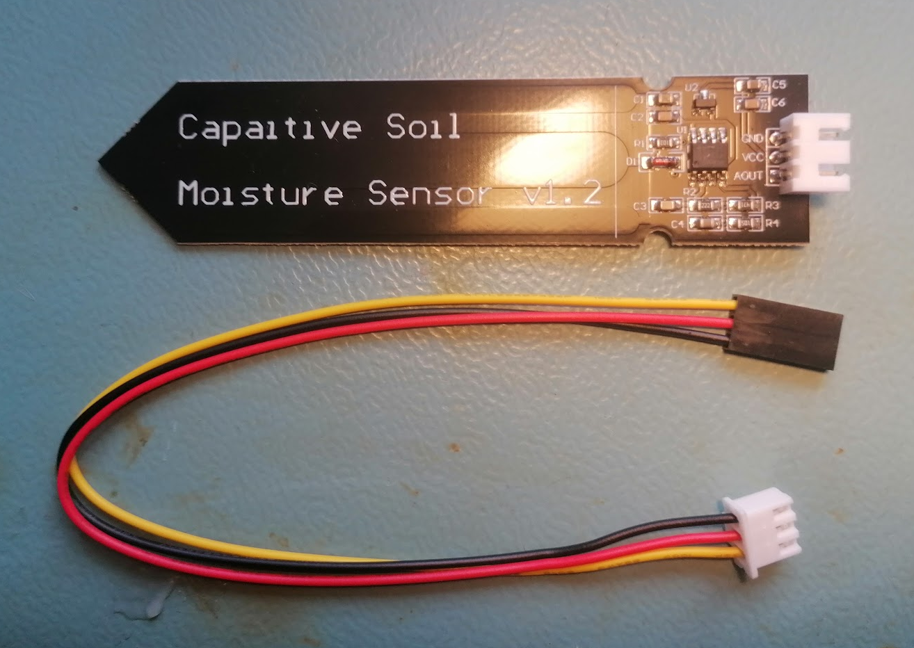
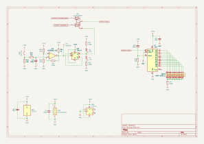

# Purpose

This section describes the electronic circuit of this device.

# Tools

The circuit was made in KiCad.

# Used modules

These cheap modules were used in this device; they or their clones are available on AliExpress or similar sites:
* 0.28 Inch LED Digital Display DC Voltmeter 0-100V 2.5-30V

* [JSB1523006 (probably JSB1523008 can be also used): datasheet](https://en.symtek.com.tw/wp-content/uploads/sites/2/2019/03/JSB1523008.pdf
) DC 5V 6V 030 Mini Vacuum Pump Air Pump Oxygen Pump Diaphragm Pump Current 80mA 60KPa 0.6L/min

* Capacitive Soil Moisture Sensor Module Corrosion Resistant Wide Voltage Wire Analog Capacitive Soil Moisture Sensor V1.2

* [Potentiometer: datasheet](https://www.tme.eu/Document/44aa78351c5c809af1765772b5b113b7/R16148-1A-1.pdf)
* 4x M2 screw
* 4x M2 nut
* 4x M3 screw
* 4x M3 nut

# Electronic diagrams

