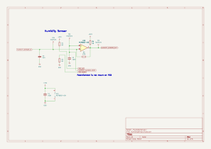

# Purpose

This section describes the electronic circuit of this device.

# Tools

The circuit was made in KiCad.

# Used modules

These cheap modules were used in this device; they or their clones are available on AliExpress or similar sites:
* 0.28 Inch LED Digital Display DC Voltmeter 0-100V 2.5-30V

* JSB1523006 DC 5V 6V 030 Mini Vacuum Pump Air Pump Oxygen Pump Diaphragm Pump Current 80mA 60KPa 0.6L/min

* Capacitive Soil Moisture Sensor Module Corrosion Resistant Wide Voltage Wire Analog Capacitive Soil Moisture Sensor V1.2

# Electronic diagrams

