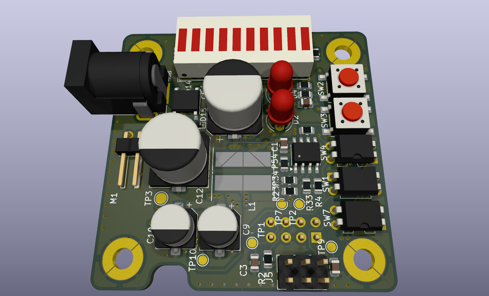
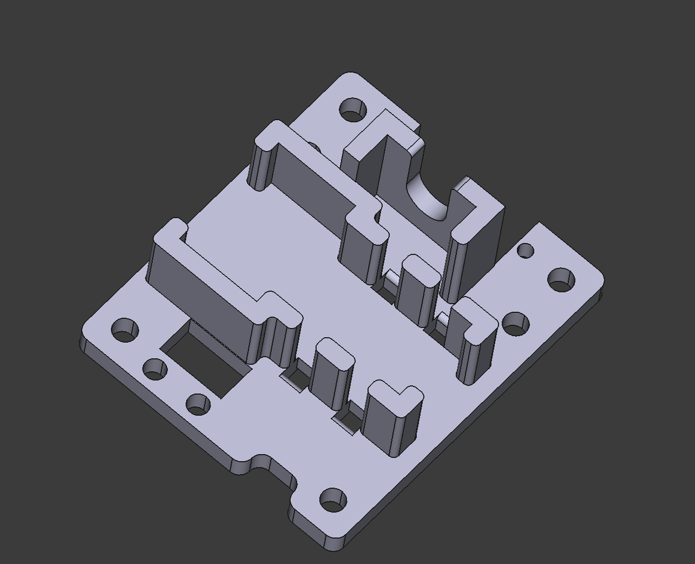

# Plant Watering Device

This is a device for watering indoor plants based on the 8-pin PIC10F200-IOT microcontroller.

The goal is to try to make a project on this small MCU and learn how to deal with the limitations of such a small chip, as well as to learn the PIC MCU family ecosystem.

Features:

* **Sensing soil humidity** using a cheap capacitance sensor
* **Display of actual soil humidity and low-level soil humidity when the watering is started;** what is presented on the display is selected by a button, and an additional two LEDs indicate the current reading shown on the display
* Possibility to **change the quantity of water that is dispersed when the soil is detected as dry;** the level can be modified via a button and the current setting is shown on a 10-segment LED bargraph
* Possibility to **select the moisture level when the soil is considered dry** and the watering should be started via a potentiometer

## Software

The software will be written in assembler.

## Hardware

[Hardware specifications and assembly details.](./Hardware/PlantWateringDevice/README.md)

Design tools: KiCad

## Mechanical

In order to keep the pump, PCB, display, and potentiometer in one place, a simple 3D printed holder was made.

[Mechanical specifications and assembly details.](./Mechanic/README.md)

Design tools: OpenSCAD and FreeCad

