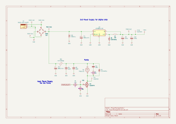

# Plant Watering Device

This is a device for watering indoor plants based on the 8-pin PIC10F200-IOT microcontroller.

The main goal is to try to make a project on this small microcontroller and deal with its limitations.

Features:
* Dual watering modes:
 * Automatic: Waters the plant when the soil humidity sensor detects dry soil
 * Scheduled: Waters at configurable intervals with configurable water amounts
* 3D-printable chassis that securely mounts both the pump and PCB
* LED bar indicator for status monitoring

## Software

The software will be written in assembler.

## Hardware

A lot of cheap modules were used to simplify the design.

Design tools: KiCad

## Mechanical

[Mechanical specifications and assembly details.](./Mechanic/README.md)