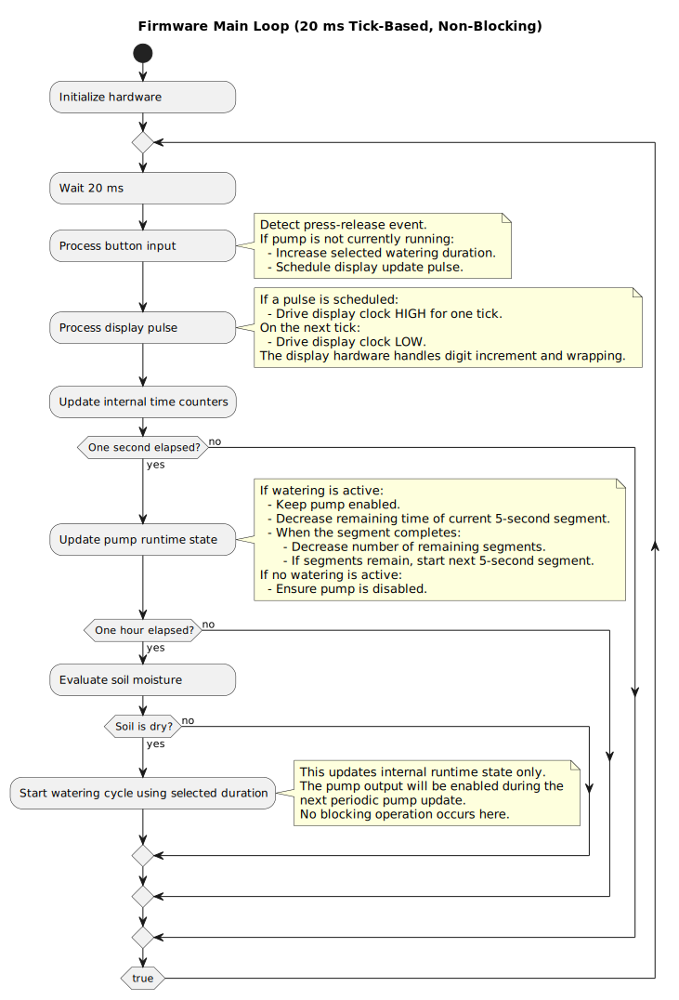

# Purpose
[PIC10F202-IOT](http://ww1.microchip.com/downloads/en/DeviceDoc/41239D.pdf
) chip is a small PIC family microcontroller used for gathering soil humidity level and driving the water pump. This section describes project structure, setup, and flashing the device.

# Architecture



# Prerequisites

## Hardware:
* I use PICKit3 to program the chip.
  * The pro is that it's cheap and does the job.
  * The con is that it's marked as obsolete by Microchip; I've found it hard/impossible to integrate with the MPLAB ecosystem.

## Software

* [Install MPLAB X IDE](https://www.microchip.com/en-us/tools-resources/develop/mplab-x-ide), use the latest version
* If you (like me) don't see PICKit3 enumerated in MPLAB IPE, switch to flashing using open source [PICkit tool](https://github.com/jaka-fi/PICkitminus)
* Visual Studio Code - more modern/lightweight than developing in MPLAB X IDE.
* [Assembly highlighting](https://marketplace.visualstudio.com/items?itemName=zhihao1021.pic18-assembly-language) - it's not the most suited for this assembly dialect but I didn't find anything better.

# Usage

* In VS Code open folder Software/PlantWateringDevice.X
* You will be asked if you want to import the project. Do it.
* Press Ctrl+Shift+B to build. The file to be flashed is (from project root perspective) in ```Software/PlantWateringDevice.X/dist/default/production/PlantWateringDevice.X.production.hex```
* Use PICkit (mentioned in requirements) or MPLAB IPE to flash it.

**Note:** the VS Code configuration is for Windows and assumes you are using ```MPLAB v6.30```. If that's not the case, update the paths in [PlantWateringDevice.X/.vscode/tasks.json](./PlantWateringDevice.X/.vscode/tasks.json)

# Tests

There is a small set of manual integration tests, [more details here](./PlantWateringDevice.X/tests/README.md).
